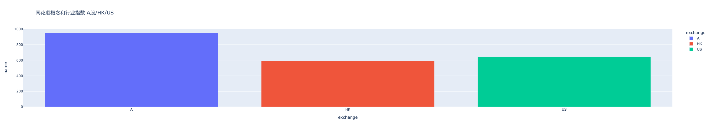
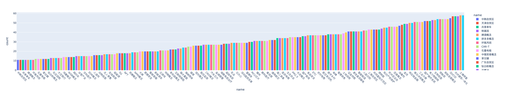
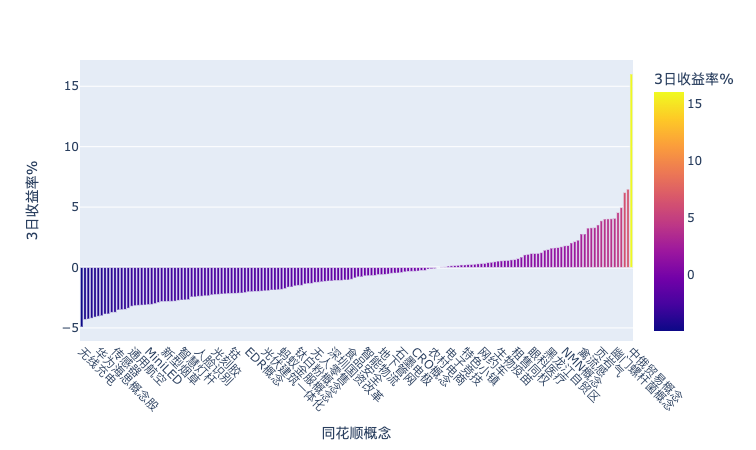
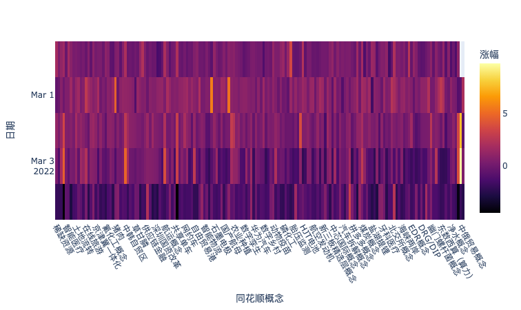

# This repo is about my study on Quantitative Finance
不定期更新一些量化策略或者研究。

# Tushare发掘热门同花顺概念
如何使用Tushare发掘同花顺热门概念板块。

Tushare ID: 494365

以下内容的代码在**同花顺行业概念EDA.ipynb**中。

## 同花顺行业概念EDA (Exploratory Data Analysis)

我们首先看一下同花顺所有的行业和概念指数

可以看出大A中大概有900个行业和概念指数，接下来要分析的是每个概念或者行业中成分股的个数，如果一个概念或者行业包含的成分股太多或者太少，相当于涵盖面太广或者太窄，意义不大，下图展示了各个概念或者行业中成分股的多少的分布：

可以看出每个概念或者行业中平均含有53个成分股，我们取10（<25%分位值）和60（>75%分位值）作为两个阈值来过滤概念，并且剔除重复项

接下来我们要做的就是获取每个指数的N日数据，因为我比较关心短线热度，所以我这里主要计算1日，3日和5日收益率，所以这里取N=10日数据就够了。

数字并不能很好的反应热度，我们可以用一个barplot然后用3日收益率排序来可视化（数据截止2022/3/4）

 

可以看出周五的大跌😭并且最近很火的俄乌冲突概念。也可以画一个1日收益率的heatmap，每日热点一目了然

由于tushare无法获取实时数据，所以只能每天收盘后跑一下看看当日的热点。

最后一步是把热点板块中的龙头给抓出来，但是由于获取概念成分股需要5000积分的权限（我只有1600😭），所以只能暂时止步于此了。

