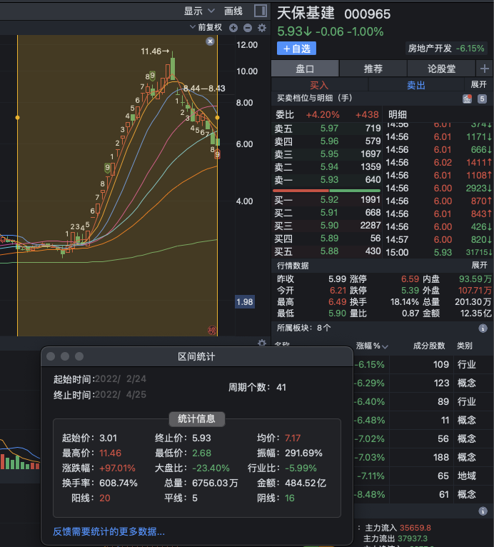
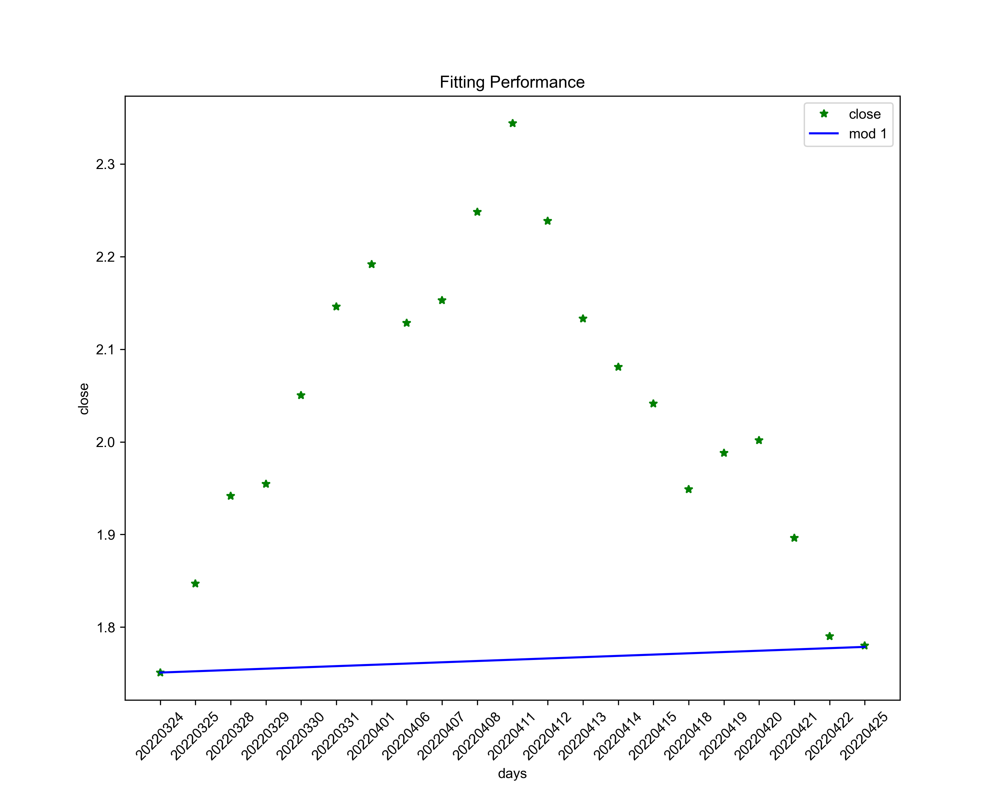
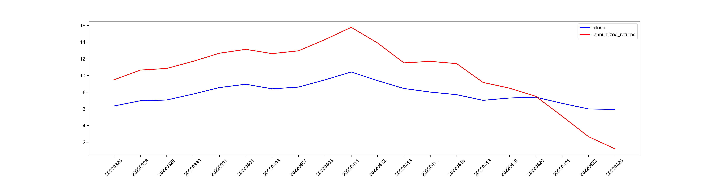
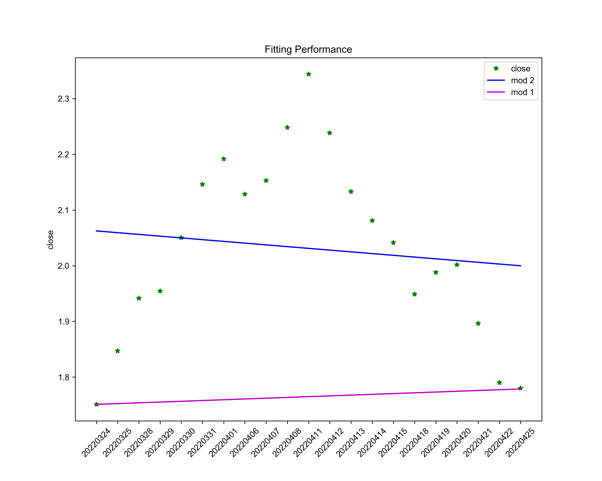
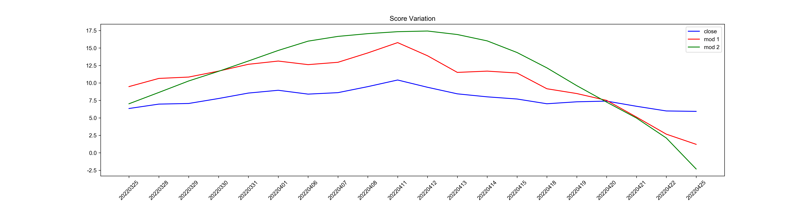

# RSRS策略不同模型验证

# Preliminaries

## Math Model
因为我们的策略是想要尽量的找到股价表现强势, 且有能够形成趋势的个股, 我们对股票的收盘价进行建模: 
$$
y = (1+N\%)^n*x
$$

这里$y\,$是n天之后的收盘价，$x\,$是期初的收盘价。这就是一个复利问题，这么一看是一个指数函数不太好处理，我们对两边取对数：
$$
\log y =\log[(1+N\%)^n*x]
$$
可以化简为
$$
\log y = n*\log(1+N\%) + \log x
$$
我们重新定义一下变量
$$
Y &=& \log y\\
k &=& \log (1+N\%)\\
n &=& x\\
b &=& \log x
$$
那么我们的模型就变为了一个很简单的一次函数模型：
$$
Y = k*x+b
$$
接下来我们要做的就是对股票池里的所有个股都按照这个模型进行打分，我们构造一个统计量来为这个模型评分，我们称这个统计量为年化收益 $\alpha$:
$$
\alpha=(e^{k*250} - 1) * R^2
$$
这里假设了一年有250个交易日，每个交易日的收益率为$e^k$即$1+N\%$，$R^2$是评价模型拟合好坏的一个量，它等于
$$
R^2 = \frac{\sum (y-y')^2}{\sum (y-\bar{y})^2}
$$
这里$y'$是模型预测值，$\bar{y}$是n天收盘价的平均值。就是这样一个简单的数学模型，接下来让我们以\$天保基建这只大牛股为例，来介绍一下该模型的应用。
# 实际应用
## 策略
在进行实例之前先介绍一下我们的策略：通过上面构建的统计量$\alpha\,$给股票池里的所有个股打分，只够买得分最高的那一只。
## 实例
以\$天保基建为例，我们通过**TUSHARE**获取了其22年2月24日到4月25日总共41天的日线数据来进行实验。实际的策略回测部署在聚宽上[RSRS策略](https://www.joinquant.com/view/community/detail/05f09e4e904b67edfc1c28813dd7b8f2)

在开头也说了，我们的目的是为了在早期的时候尽早的介入然后在转弱的时候即使止盈，为此需要使我们的评分$\alpha\,$在连板时尽快的变大，在冲高回落后分数要尽快的降低，为此$\alpha\,$得尽可能的对收盘价敏感，接下来我们就来看看2种不同方法所构建出来的$\alpha\,$对收盘价的敏感程度。
### Mod 1
在有了历史数据后，我们可以做一件最简单的事，用第一天和最后一天的收盘价计算斜率*k*，把第一天的收盘价设为截距*b*，这样我们就有了第一个模型。
选取4月25日和之前28天的数据拟合如下

这样我们就得出了4月26日的关于该股的分数，可见*k*是很小的，所以$\alpha\,$也会很小，代表该股的趋势已经过去了。依次类推，我们可以计算出$41-29=12$个得分，我们把得分和收盘价画在一张图上

这里的得分是画的对数，所以分数的增长是很迅猛的，然后在股价开始下降后分数也开始骤降，符合我们所想要的效果。

### Mod 2
另一种方法就是用所有的数据点来进行线性回归，拟合出斜率*k*和截距*b*，然后带入Eq.(5)中计算年化收益。我们首先定义 **Momentum** 参数为要选取的数据长度，我们取 $\mathrm{Momentum}=29$，即取29天的数据来进行模型的拟合，可以根据当时的行情来调整**Momentum**的值，如果行情比较稳定这选取较大的值，如果轮动很快这可以适当调小。
一次函数的拟合结果如下

可以看到拟合出的斜率为负，也说明该股的时代已经过去了。同样的为他计算12天的得分，并且和Mod 1 一起展示出来

可以发现Mod 2 的下降有一些滞后，表示Mod2对收盘价的敏感度没有Mod1的好，这有一定的几率给我们带来很大的回撤，特别是这种趋势股，一被杀就是几十个点，所以我们宁可少赚一点也要及时的卖出，在这一点上，Mod1要优于Mod2。

# 结论
看起来简单的算法却要比复杂的表现要好，直接取第一天和最后一天的收盘价来计算得分在及时性上要优于线性回归的模型。