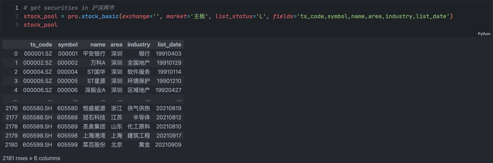
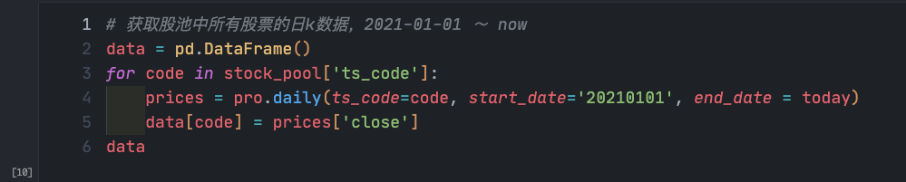
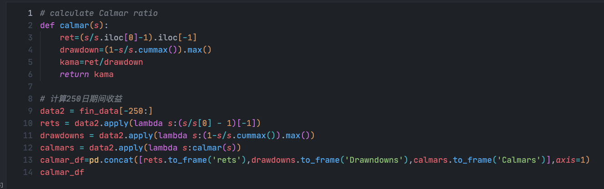
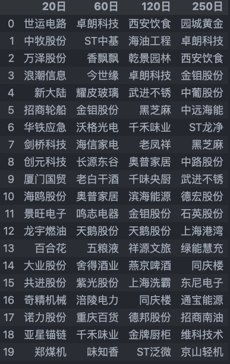

# 用卡玛因子(Calmar Ratio)来衡量个股的趋势

**卡玛因子**: 用来衡量基金业绩表现的指标，描述的是收益和最大回撤之间的关系。计算方式比较简单，为年化收益率与历史最大回撤之间的比率。Calmar 比率数值越大，基金的业绩表现越好；反之，基金的业绩表现越差。和夏普比率不同的是，卡玛比率是用最大回撤衡量风险，用年化收益率衡量收益。
接下来我们就用不同窗口的卡玛比率来筛选个股，具体的代码参考 ipynb。

# Data Preparation

首先我们用 Tushare 获取主板的所有标的代码

接下来通过循环调用来获取 2021 年 1 月 1 日至今的所有标的的收盘价

在进行一些数据清理后，计算卡玛比率

最后计算不同窗口的卡玛比率并进行排序

表中的股票近期的表现都比较强势，说明用卡玛比率来进行趋势的判断有一定意义。
